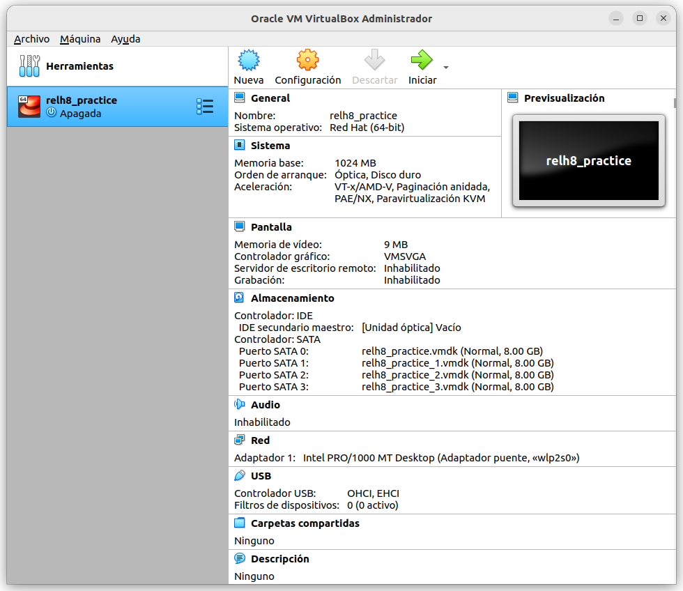
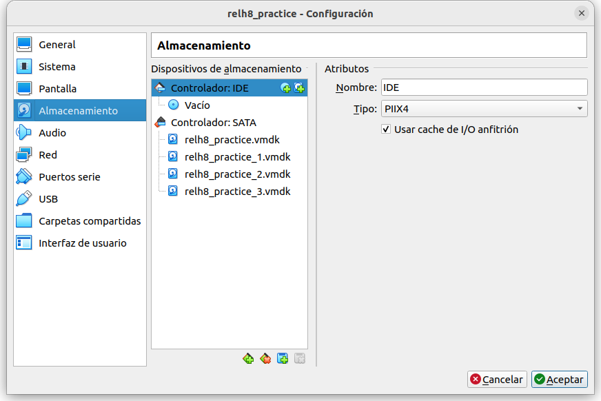
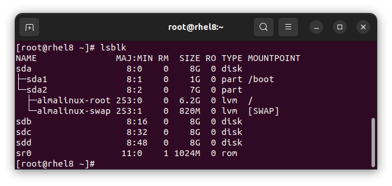
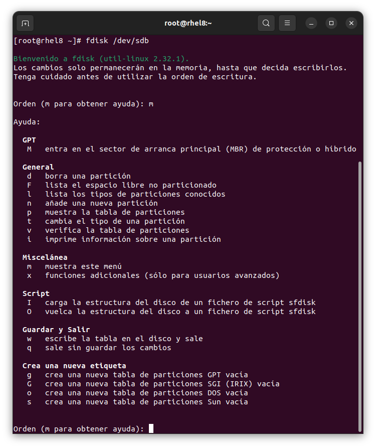

# VirtualBox
### Creamos una maquina virtual en virtualbox con estas especificaciones para el ejemplo

# lsblk
### Iniciar sesión de preferencia con la cuenta administrador en la maquian virtual, ejecutamos el comando ***lsblk*** para ver información de los ***hdd***

`[roo@rhel8 ~]# lsblk`

# fdisk
### Ejecutamos el comando ***fdisk*** para seleccionar los ***hdd*** a formatear con ***filesystem LVM*** para luego agregarlos al grupo de volumen y extenderlo

`[roo@rhel8 ~]# fdisk /dev/sdb`

