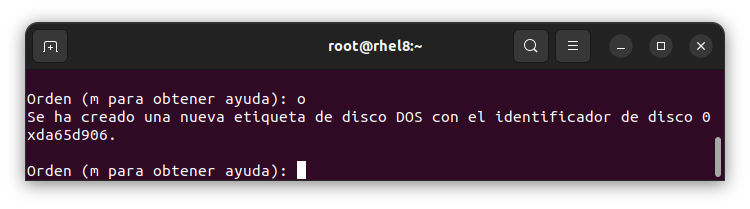
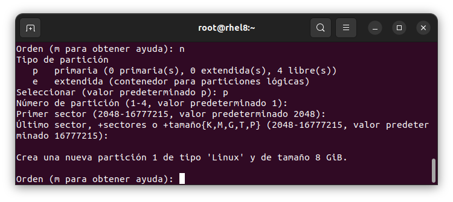
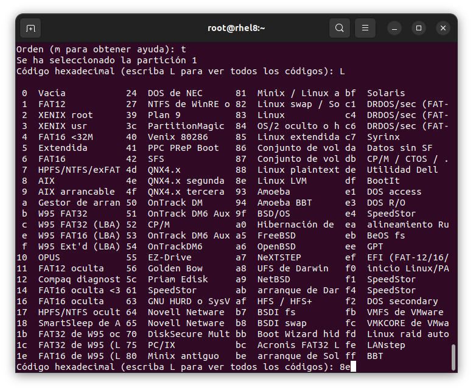
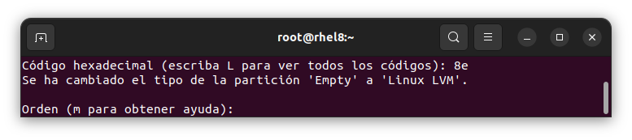
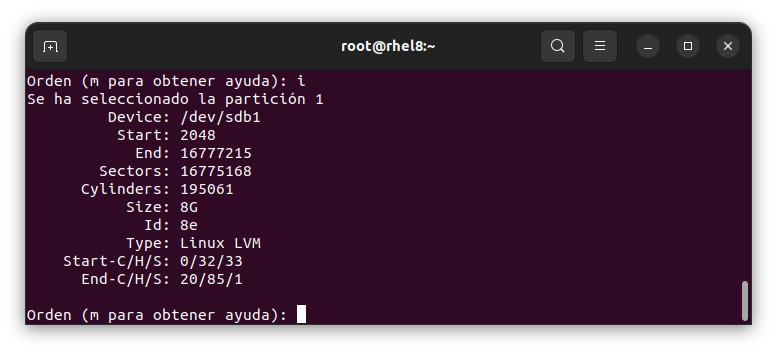
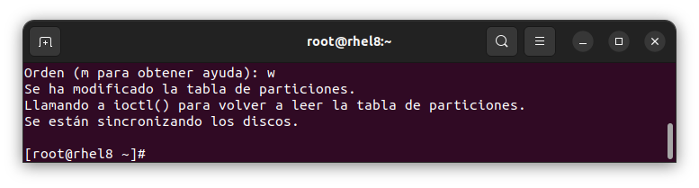

# VirtualBox
### Creamos una maquina virtual en virtualbox con estas especificaciones para el ejemplo

# lsblk
### Iniciar sesión de preferencia con la cuenta administrador en la maquian virtual, ejecutamos el comando **lsblk** para ver información de los **hdd**

`[roo@rhel8 ~]# lsblk`

# fdisk
### Ejecutamos el comando **fdisk** para seleccionar los **hdd** a formatear, con **filesystem LVM** para luego agregarlos al grupo de volumen y extenderlo.

`[roo@rhel8 ~]# fdisk /dev/sdb`

### presionamos **o** para generar una nueva tabla de partición **DOS vacía**
> nota: por que **o** y no otras de las demas, por que estamos usando un sistemas con bios normal y si usaramos efi seria **g** 

### luego de eso presionamos **n** para crear una nueva partition, escogemos **p** para selecionar una partición primaria y a todo lo demas lo dejamos por default, presionando enter para continuar

### luego de eso cambiamos el tipo de partición presionamos **t** y luego **L** para imprimir los tipos de particiones y buscamos la **Linux LVM** que su codigo es **8e**

### presionamos enter para guardar los cambios en la nueva particion creada

### presionamos **i** para imprimir un resumen de los cambios realizados

## luego presionamos **w** para guardar los cambios realizados en la nueva tabla de particiones. Esto lo hacemos con los demas disco que tiene la maquina virtual

`[roo@rhel8 ~]# fdisk /dev/sdc`

`[roo@rhel8 ~]# fdisk /dev/sdd`